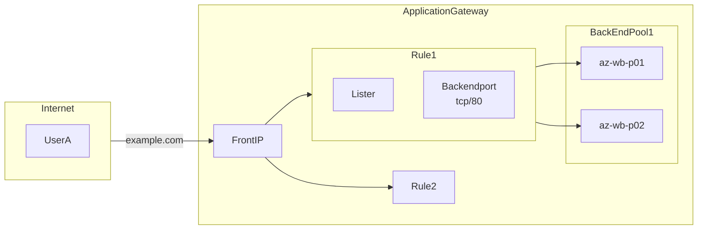
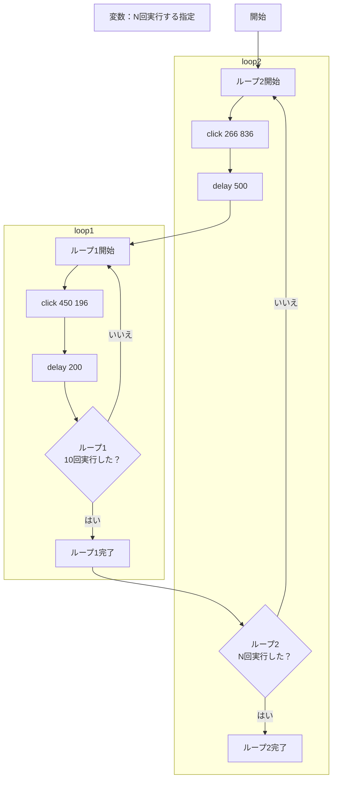
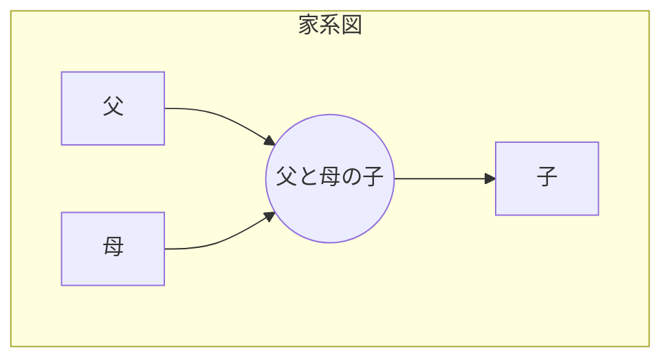
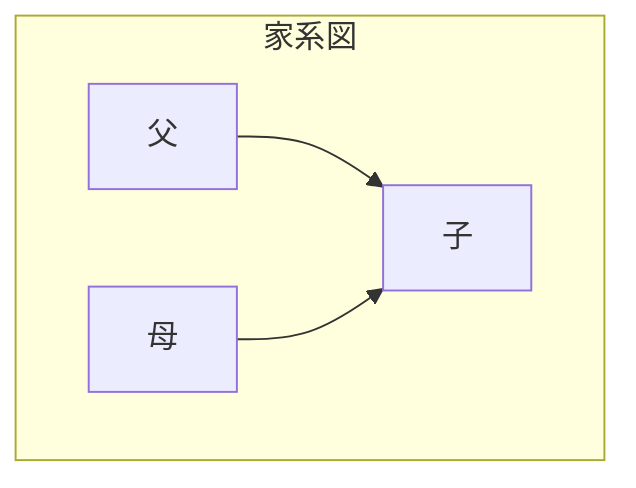
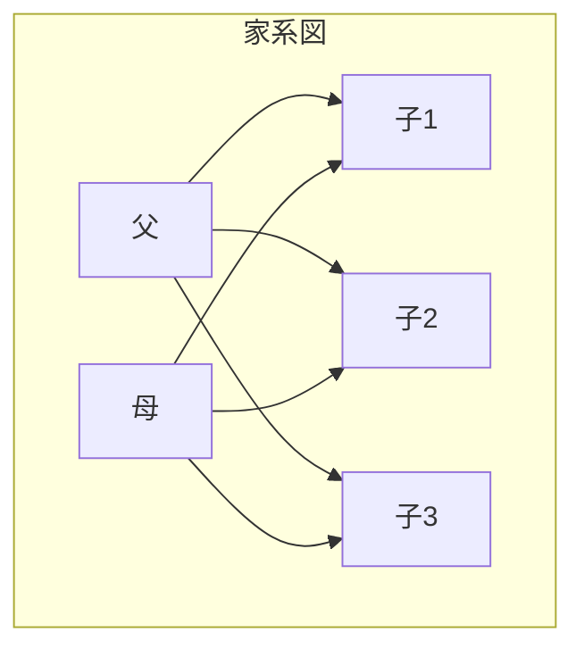
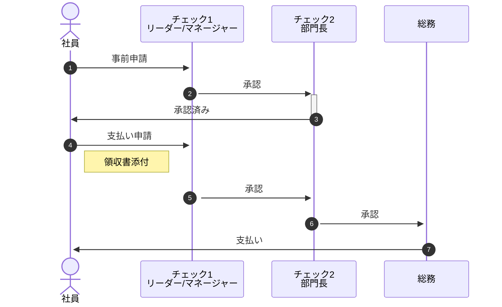

## はじめに

Markdownで使える便利なmermaid記法は、文字で記載し図形を描画できます。  

### 種類

種類は[公式サイト](https://mermaid.js.org/)に記載されている下記の通りです。

| #   | Diagram Syntax                                                                              |
| :-- | :-------------------------------------------------------------------------------------------|
| 1   | [Basic flowchart](https://mermaid.js.org/syntax/flowchart.html#flowcharts-basic-syntax)     |
| 2   | [Sequence diagrams](https://mermaid.js.org/syntax/sequenceDiagram.html)                     |
| 3   | [Class diagrams](https://mermaid.js.org/syntax/classDiagram.html)                           |
| 4   | [State Diagram](https://mermaid.js.org/syntax/stateDiagram.html)                            |
| 5   | [Entity Relationship Diagram](https://mermaid.js.org/syntax/entityRelationshipDiagram.html) |
| 6   | [User Journey](https://mermaid.js.org/syntax/userJourney.html)                              |
| 7   | [Gantt](https://mermaid.js.org/syntax/gantt.html)                                           |
| 8   | [Pie Chart](https://mermaid.js.org/syntax/pie.html)                                         |
| 9   | [Quadrant Chart](https://mermaid.js.org/syntax/quadrantChart.html)                          |
| 10  | [Requirement Diagram](https://mermaid.js.org/syntax/requirementDiagram.html)                |
| 11  | [Gitgraph (Git) Diagram](https://mermaid.js.org/syntax/gitgraph.html)                       |
| 12  | [C4 Diagram](https://mermaid.js.org/syntax/c4.html)                                         |
| 13  | [Mindmaps](https://mermaid.js.org/syntax/mindmap.html)                                      |
| 14  | [Timeline](https://mermaid.js.org/syntax/timeline.html)                                     |
| 15  | [Sankey](https://mermaid.js.org/syntax/sankey.html)                                         |
| 16  | [XYChart](https://mermaid.js.org/syntax/xyChart.html)                                       |
| 17  | [Block Diagram](https://mermaid.js.org/syntax/block.html)                                   |

以下、mermaidで記述した図/併せてmermaidのcodeを記載します。

## [Basic flowchart](https://mermaid.js.org/syntax/flowchart.html#flowcharts-basic-syntax) - 基本フローチャート

- 基本

  ```mermaid
  graph TD;
      A-->B;
      A-->C;
      B-->D;
      C-->D;
  ```

  :::details code

  ````text
  ```mermaid
  graph TD;
      A-->B;
      A-->C;
      B-->D;
      C-->D;
  ```
  ````

  :::

### DBサーバ Primary/Secondary構成切り替わり

- 通常時

  ```mermaid
  flowchart LR
      LB[LoadBalancer]
      LB --> A[Web1]
      LB --> B[Web2]
      LB --> C[Web3]
      LB --> D[Web4]
      A --> VIP
      B --> VIP
      C --> VIP
      D --> VIP
      subgraph "DB Cluster"
          VIP == P ==> DB1[(DB1)]
          VIP -- S --x DB2[(DB2)]
          Annotation[P:Primary<br>S:secondary]
      end
  ```

  :::details code

  ````text
  ```mermaid
  flowchart LR
      LB[LoadBalancer]
      LB --> A[Web1]
      LB --> B[Web2]
      LB --> C[Web3]
      LB --> D[Web4]
      A --> VIP
      B --> VIP
      C --> VIP
      D --> VIP
      subgraph "DB Cluster"
          VIP == P ==> DB1[(DB1)]
          VIP -- S --x DB2[(DB2)]
          Annotation[P:Primary<br>S:secondary]
      end
  ```
  ````

  :::

- 障害時

  ```mermaid
  flowchart LR
      LB[LoadBalancer]
      LB --> A[Web1]
      LB --> B[Web2]
      LB --> C[Web3]
      LB --> D[Web4]
      A --> VIP
      B --> VIP
      C --> VIP
      D --> VIP
      subgraph "DB Cluster"
          VIP -- S --x DB1[(DB1)]
          VIP -- P --> DB2[(DB2)]
          Annotation[P:Primary<br>S:secondary]
      end
  
      classDef classA fill:#f00,stroke:#fff,stroke-width:5px;
      class DB1 classA;
  ```

  :::details code

  ````text
  ```mermaid
  flowchart LR
      LB[LoadBalancer]
      LB --> A[Web1]
      LB --> B[Web2]
      LB --> C[Web3]
      LB --> D[Web4]
      A --> VIP
      B --> VIP
      C --> VIP
      D --> VIP
      subgraph "DB Cluster"
          VIP -- S --x DB1[(DB1)]
          VIP -- P --> DB2[(DB2)]
          Annotation[P:Primary<br>S:secondary]
      end
  
      classDef classA fill:#f00,stroke:#fff,stroke-width:5px;
      class DB1 classA;
  ```
  ````

  :::

### Azure - ApplicationGateway構成



:::details code

````text

````

:::

### 処理フロー ループありバージョン



:::details code

````text

````

:::

### 家系図

家系図をmermaidで書いてみたサイトがありました。なかなかおもしろい。  
参考にしたサイト [フクロモモンガ家系図.md](https://gist.github.com/gelehrtecrest/ab4f6188602ec3b70f2bfd85e6a4af99)

一世代のみの簡易な家系図



:::message
コラム
なぜ、**父と母の子** というオブジェクトが必要なのか？  
**父と母の子** のオブジェクトなしで記載してみましょう。



うまくいきそうですね。  
3人なら・・？



はい、複雑！  
3人以上の子どもがいる場合は、間に**父と母の子**オブジェクトを挟むのがいいですね。
:::

- 例）サザエさん家系図  
  二世代の例として、サザエさん一家をmermaid形式で記述

  ```mermaid
  graph TB;
      subgraph 磯野家
          namihei_with_fune["波平"] --> namihei_fune((波平とフネの子))
          fune_with_namihei["フネ"] --> namihei_fune
          namihei_fune --> namihei_fune1["長女：サザエ"]
          namihei_fune --> namihei_fune2["長男：カツオ"]
          namihei_fune --> namihei_fune3["次女：ワカメ"]
      end
  
      subgraph フグ田家
          namihei_fune1 --- sazae_with_masuo
          msuo_with_sazae["マスオ"] --> msuo_sazae((マスオとサザエ))
          sazae_with_masuo["サザエ"] --> msuo_sazae
          msuo_sazae --> msuo_sazae1["タラオ"]
      end
  ```

## [Sequence diagrams](https://mermaid.js.org/syntax/sequenceDiagram.html) - シーケンス図

### よくある清算フロー



::::details code

:::message
autonumber を記載すると、自動で番号を付与してくれる(便利)
:::

````text

````

::::

## 参考サイト

- [Mermaid 入門してみたメモ(flowchart で力尽きた…)](https://zenn.dev/okazuki/articles/learning-mermaid)
- [mermaidでフローチャートを描く](https://zenn.dev/yuriemori/articles/e097dbd950df86)
- [Mermaid でシーケンス図を書く方法を解説！Notion AI にシーケンス図を書いてもらったら…!? | キカガクブログ](https://www.kikagaku.co.jp/kikagaku-blog/mermaid-sequence/)
- [Mermaid.jsでデータフロー図を描く](https://blog.naoty.dev/409/)
- [mermaid.jsのフローチャートの書き方](https://ryuta46.com/516)
- [よくあるAWSサーバーレス構成のシーケンス図をMarkdown（Mermaid）で描いてみた | DevelopersIO](https://dev.classmethod.jp/articles/drawing-a-sequence-diagram-of-a-common-aws-serverless-configuration-with-mermaid/)
- [mermaid.js で上流工程を好きになろう](https://qiita.com/caesar_cat/items/e8a116a585863633d15a)
