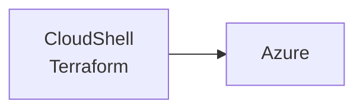
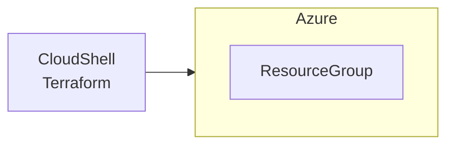

## 本Lessonでの学習内容

とりあえずリソースをTerraformで作成してみましょう。
今回はResourceGroupを作って消します。

### イメージ図

before



after



### 使用するファイル

<https://github.com/roota5666/book-contents_azure-x-terraform/blob/main/lesson1/main.tf>

## 手順

1. Gitの資材 lesson1にcdする

   ```bash
   cd lesson1
   ```

1. 下記コマンドを実行する

   ```bash
   terraform init
   ```

   :::message alert
   研修など、同じテナント内で複数人で実行する際はエラーになるため
   `main.tf` 内 `name` の `"rg_example"` を任意の名前に変更してください。
   :::
   :::details 実行結果例

   ```bash
   r_ota [ ~/clouddrive/git/book-contents_azure-x-terraform/lesson1 ]$ terraform init

   Initializing the backend...
   
   Initializing provider plugins...
   - Finding latest version of hashicorp/azurerm...
   - Installing hashicorp/azurerm v3.93.0...
   - Installed hashicorp/azurerm v3.93.0 (signed by HashiCorp)
   
   Terraform has created a lock file .terraform.lock.hcl to record the provider
   selections it made above. Include this file in your version control repository
   so that Terraform can guarantee to make the same selections by default when
   you run "terraform init" in the future.
   
   Terraform has been successfully initialized!
   
   You may now begin working with Terraform. Try running "terraform plan" to see
   any changes that are required for your infrastructure. All Terraform commands
   should now work.
   
   If you ever set or change modules or backend configuration for Terraform,
   rerun this command to reinitialize your working directory. If you forget, other
   commands will detect it and remind you to do so if necessary.
   r_ota [ ~/clouddrive/git/book-contents_azure-x-terraform/lesson1 ]$ 
   ```

   :::
1. 下記コマンドを実行する

   ```bash
   terraform plan
   ```

   :::details 実行結果例

   ```bash
   r_ota [ ~/clouddrive/git/book-contents_azure-x-terraform/lesson1 ]$ terraform plan
   
   Terraform used the selected providers to generate the following execution plan. Resource actions are indicated with the following symbols:
     + create
   
   Terraform will perform the following actions:
   
     # azurerm_resource_group.rg will be created
     + resource "azurerm_resource_group" "rg" {
         + id       = (known after apply)
         + location = "japaneast"
         + name     = "rg_example"
         + tags     = {
             + "owner"  = "example@example.com"
             + "source" = "terraform"
           }
       }
   
   Plan: 1 to add, 0 to change, 0 to destroy.
   
   ─────────────────────────────────────────────────────────────────────────────────────────────────────────────────────────────────────────────────
   
   Note: You didn't use the -out option to save this plan, so Terraform can't guarantee to take exactly these actions if you run "terraform apply"
   now.
   r_ota [ ~/clouddrive/git/book-contents_azure-x-terraform/lesson1 ]$ 
   ```

   :::

1. 下記コマンドを実行する

   ```bash
   terraform apply
   ```

1. 下記が出るのでyesを押下する
   >Do you want to perform these actions?  
   >Terraform will perform the actions described above.  
   >Only 'yes' will be accepted to approve.  
   >
   >Enter a value:
   :::details 実行結果例

   ```bash
   r_ota [ ~/clouddrive/git/book-contents_azure-x-terraform/lesson1 ]$ terraform apply

   Terraform used the selected providers to generate the following execution plan. Resource actions are indicated with the following symbols:
     + create
   
   Terraform will perform the following actions:
   
     # azurerm_resource_group.rg will be created
     + resource "azurerm_resource_group" "rg" {
         + id       = (known after apply)
         + location = "japaneast"
         + name     = "rg_example"
         + tags     = {
             + "owner"  = "example@example.com"
             + "source" = "terraform"
           }
       }
   
   Plan: 1 to add, 0 to change, 0 to destroy.
   
   Do you want to perform these actions?
     Terraform will perform the actions described above.
     Only 'yes' will be accepted to approve.
   
     Enter a value: yes
   
   azurerm_resource_group.rg: Creating...
   azurerm_resource_group.rg: Creation complete after 1s [id=/subscriptions/xxxxxxxx-xxxx-xxxx-xxxx-xxxxxxxxxxxx/resourceGroups/rg_example]
   
   Apply complete! Resources: 1 added, 0 changed, 0 destroyed.
   r_ota [ ~/clouddrive/git/book-contents_azure-x-terraform/lesson1 ]$
   ```

   :::

1. 作成したリソース(ResourceGroup)を下記コマンドを実行して確認する

   ```bash
   RESOURCE_GROUP=rg_example
   az group list --query "[?name=='$RESOURCE_GROUP']"
   ```

1. 作成したリソース(ResourceGroup)をAzureポータルから確認する

   

1. 下記コマンドを実行する

   ```bash
   terraform state list
   ```

   :::details 実行結果例

   ```bash
   r_ota [ ~/clouddrive/git/book-contents_azure-x-terraform/lesson1 ]$ terraform state list
   azurerm_resource_group.rg
   r_ota [ ~/clouddrive/git/book-contents_azure-x-terraform/lesson1 ]$ 
   ```

   :::
1. 下記コマンドを実行して作成したリソース(ResourceGroup)を削除する

   ```bash
   terraform destroy
   ```

1. 下記が出るのでyesを押下する
   >Plan: 0 to add, 0 to change, 1 to destroy.
   >
   >Do you really want to destroy all resources?
   > Terraform will destroy all your managed infrastructure, as shown above.
   > There is no undo. Only 'yes' will be accepted to confirm.
   >
   > Enter a value: yes
   :::details 実行結果例

   ```bash
   r_ota [ ~/clouddrive/git/book-contents_azure-x-terraform/lesson1 ]$ terraform destroy
   azurerm_resource_group.rg: Refreshing state... [id=/subscriptions/xxxxxxxx-xxxx-xxxx-xxxx-xxxxxxxxxxxx/resourceGroups/rg_example]

   Terraform used the selected providers to generate the following execution plan. Resource actions are indicated with the following symbols:
     - destroy

   Terraform will perform the following actions:

     # azurerm_resource_group.rg will be destroyed
     - resource "azurerm_resource_group" "rg" {
         - id       = "/subscriptions/xxxxxxxx-xxxx-xxxx-xxxx-xxxxxxxxxxxx/resourceGroups/rg_example" -> null
         - location = "japaneast" -> null
         - name     = "rg_example" -> null
         - tags     = {
             - "owner"  = "example@example.com"
             - "source" = "terraform"
           } -> null
       }

   Plan: 0 to add, 0 to change, 1 to destroy.

   Do you really want to destroy all resources?
     Terraform will destroy all your managed infrastructure, as shown above.
     There is no undo. Only 'yes' will be accepted to confirm.

     Enter a value: yes

   azurerm_resource_group.rg: Destroying... [id=/subscriptions/xxxxxxxx-xxxx-xxxx-xxxx-xxxxxxxxxxxx/resourceGroups/rg_example]
   azurerm_resource_group.rg: Still destroying... [id=/subscriptions/xxxxxxxx-xxxx-xxxx-xxxx-xxxxxxxxxxxx/resourceGroups/rg_example, 10s elapsed]
   azurerm_resource_group.rg: Still destroying... [id=/subscriptions/xxxxxxxx-xxxx-xxxx-xxxx-xxxxxxxxxxxx/resourceGroups/rg_example, 20s elapsed]
   azurerm_resource_group.rg: Still destroying... [id=/subscriptions/xxxxxxxx-xxxx-xxxx-xxxx-xxxxxxxxxxxx/resourceGroups/rg_example, 30s elapsed]
   azurerm_resource_group.rg: Still destroying... [id=/subscriptions/xxxxxxxx-xxxx-xxxx-xxxx-xxxxxxxxxxxx/resourceGroups/rg_example, 40s elapsed]
   azurerm_resource_group.rg: Still destroying... [id=/subscriptions/xxxxxxxx-xxxx-xxxx-xxxx-xxxxxxxxxxxx/resourceGroups/rg_example, 50s elapsed]
   azurerm_resource_group.rg: Still destroying... [id=/subscriptions/xxxxxxxx-xxxx-xxxx-xxxx-xxxxxxxxxxxx/resourceGroups/rg_example, 1m0s elapsed]
   azurerm_resource_group.rg: Still destroying... [id=/subscriptions/xxxxxxxx-xxxx-xxxx-xxxx-xxxxxxxxxxxx/resourceGroups/rg_example, 1m10s elapsed]
   azurerm_resource_group.rg: Still destroying... [id=/subscriptions/xxxxxxxx-xxxx-xxxx-xxxx-xxxxxxxxxxxx/resourceGroups/rg_example, 1m20s elapsed]
   azurerm_resource_group.rg: Destruction complete after 1m21s

   Destroy complete! Resources: 1 destroyed.
   r_ota [ ~/clouddrive/git/book-contents_azure-x-terraform/lesson1 ]$ 
   ```

   :::
1. リソース(ResourceGroup)がなくなったことを確認する

   ```bash
   RESOURCE_GROUP=rg_example
   az group list --query "[?name=='$RESOURCE_GROUP']"
   ```

## まとめ

- リソースをTerraformで作ったよ
- 作ったリソースをTerraformで削除したよ
- terraform.tfstate が作成されたことを確認したよ
