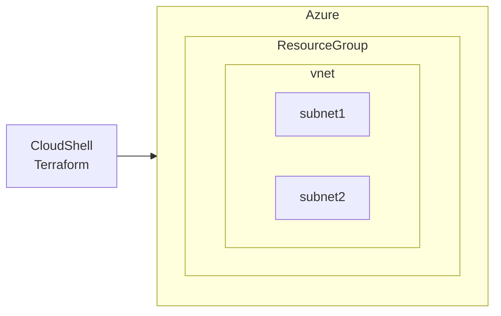

## 本Lessonでの学習内容

通常、Azureで次のリソースを作成する際、順番が決まっています。

1. resource group
1. vnet
1. subnet

Terraformでは、リソースの作成時に依存関係を解決してくれます。

今回、tfファイル内へのリソース記述順番を下記のようにしています。

1. subnet
1. vnet
1. resource group

シェルスクリプトなど、上から順番に実行される場合はエラーになるはずです。
Terraform ではどうなるかLesson2 実施してみましょう。

### イメージ図



### 使用するファイル

https://github.com/roota5666/book-contents_azure-x-terraform/blob/main/lesson2/main.tf

## 手順

1. Gitの資材 lesson2にcdする
   ```bash
   cd ../lesson2
   ```
1. 下記コマンドを実行する
   ```bash
   terraform init
   ```
   :::message alert
   研修など、同じテナント内で複数人で実行する際はエラーになるため
   `main.tf` 内 `name` の `"rg_example"` を任意の名前に変更してください。
   ```bash
   resource "azurerm_resource_group" "rg" {
     name     = "rg_example"★
     location = "japaneast"
     tags = {
       owner = "example@example.com"
       source = "terraform"
     }
   }
   ```
   :::
1. 下記コマンドを実行する
   ```bash
   terraform plan
   ```
1. 下記コマンドを実行する
   ```bash
   terraform apply
   ```
1. 下記が出るのでyesを押下する
   >Do you want to perform these actions?  
   >Terraform will perform the actions described above.  
   >Only 'yes' will be accepted to approve.  
   >  
   >Enter a value: 
1. 作成したリソース(ResourceGroup)を下記コマンドを実行して確認する
   ```bash
   RESOURCE_GROUP=rg_example
   az group list --query "[?name=='$RESOURCE_GROUP']"
   ```
1. 作成したリソース(ResourceGroup)をAzureポータルから確認する
1. 下記コマンドを実行する
   ```bash
   terraform state list
   ```
1. 下記コマンドを実行して作成したリソース(ResourceGroup)を削除する
   ```bash
   terraform destroy
   ```
1. 下記が出るのでyesを押下する
   >Plan: 0 to add, 0 to change, 1 to destroy.
   >
   >Do you really want to destroy all resources?
   >  Terraform will destroy all your managed infrastructure, as shown above.
   >  There is no undo. Only 'yes' will be accepted to confirm.
   >
   >  Enter a value: yes
1. リソース(ResourceGroup)がなくなったことを確認する
   ```bash
   az group list --query "[?name=='$RESOURCE_GROUP']"
   ```

## まとめ

- Terraformでは、リソースの作成時に依存関係を解決してくれる！
