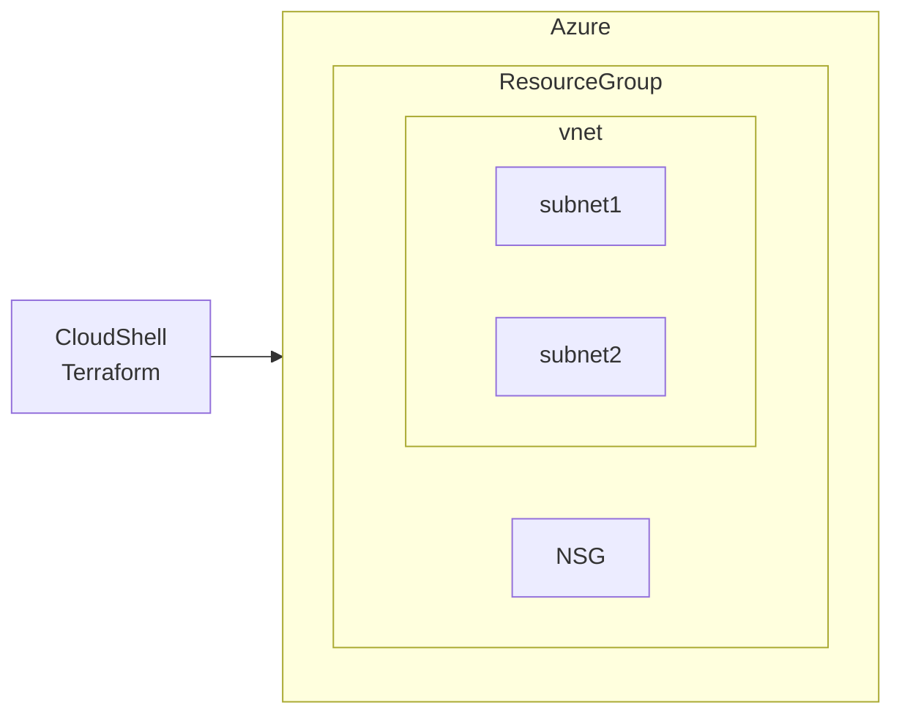

## 本Lessonでの学習内容

Lesson2 でtfファイル内へのリソース記述順番をバラバラにしても
リソースが作成されることを確認しました。

Lesson3では、ファイルを分割してリソース定義を記載して実行してみましょう。
ファイルの読み出しは？ファイルの指定は？

### イメージ図



### 使用するファイル

- main.tf
- nsg.tf
- resourcegroup.tf
- subnet.tf
- vnet.tf

## 手順

1. Gitの資材 lesson3にcdする

   ```bash
   cd lesson3
   ```

1. 下記コマンドを実行する

   ```bash
   terraform init
   ```

   :::message alert
   研修など、同じテナント内で複数人で実行する際はエラーになるため
   `resourcegroup.tf` 内 `name` の `"rg_example"` を任意の名前に変更してください。

   ```bash
   resource "azurerm_resource_group" "rg" {
     name     = "rg_example" ★
     location = "japaneast"
     tags = {
       owner = "example@example.com"
       source = "terraform"
     }
   }
   ```

   :::

1. 下記コマンドを実行する

   ```bash
   terraform plan
   ```

1. 下記コマンドを実行する

   ```bash
   terraform apply
   ```

1. 下記が出るのでyesを押下する
   >Do you want to perform these actions?  
   >Terraform will perform the actions described above.  
   >Only 'yes' will be accepted to approve.  
   >
   >Enter a value:
1. 作成したリソース(ResourceGroup)を下記コマンドを実行して確認する

   ```bash
   RESOURCE_GROUP=rg_example
   az group list --query "[?name=='$RESOURCE_GROUP']"
   ```

1. 作成したリソース(ResourceGroup)をAzureポータルから確認する
1. 下記コマンドを実行する

   ```bash
   terraform state list
   ```

1. 下記コマンドを実行して作成したリソース(ResourceGroup)を削除する

   ```bash
   terraform destroy
   ```

1. 下記が出るのでyesを押下する
   >Plan: 0 to add, 0 to change, 1 to destroy.
   >
   >Do you really want to destroy all resources?
   > Terraform will destroy all your managed infrastructure, as shown above.
   > There is no undo. Only 'yes' will be accepted to confirm.
   >
   > Enter a value: yes
1. リソース(ResourceGroup)がなくなったことを確認する

   ```bash
   az group list --query "[?name=='$RESOURCE_GROUP']"
   ```

## まとめ

- Terraformでは、ファイルを分割しても動く！
