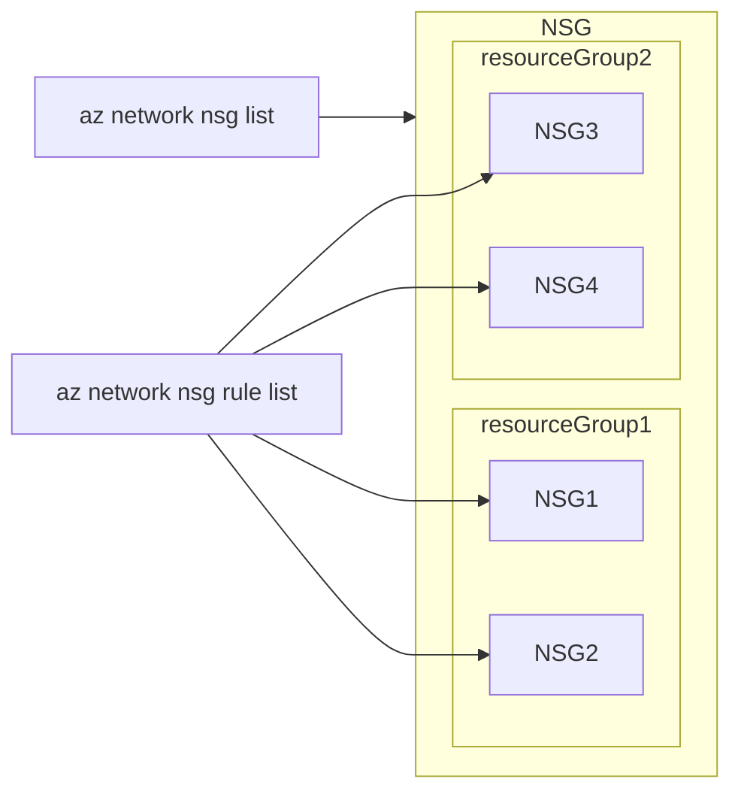

## コマンドリファレンス

- @[card](https://learn.microsoft.com/ja-jp/cli/azure/network/nsg?view=azure-cli-latest)

## [az network nsg list](https://docs.microsoft.com/ja-jp/cli/azure/network/nsg?view=azure-cli-latest#az_network_nsg_list)

### NSG一覧出力(JSON形式)

```bash
az network nsg list --output json > "${DIR}/az_network_nsg_list.json"
```

### NSG一覧出力(csv形式)

```bash
# get "az network nsg list"
var=$(az network nsg list --query [].[name,resourceGroup])
len=$(echo $var | jq length)

# csv header
echo "resourceGroup,NSG_NAME,name,access,protocol,direction,priority,sourceAddressPrefix,sourcePortRange,destinationAddressPrefix,destinationPortRange,description,id" \
	> "${DIR}/az_network_nsg_rule_list.csv"

for i in $( seq 0 $(($len - 1)) ); do
    tempnsgname=$(echo $var | jq -r .[$i][0])
    tempresourceGroup=$(echo $var | jq -r .[$i][1])


    json=$(az network nsg rule list \
        	--nsg-name $tempnsgname \
        	--resource-group $tempresourceGroup)

	# export csv
	echo $json | jq -r '.[] | [.resourceGroup,
	                           "'$tempnsgname'",
	                           .name,
	                           .access,
	                           .protocol,
	                           .direction,
	                           .priority,
	                           .sourceAddressPrefix,
	                           .sourcePortRange,
	                           .destinationAddressPrefix,
	                           .destinationPortRange,
	                           .description,
	                           .id
	                           ]|@csv' >> "${DIR}/az_network_nsg_rule_list.csv"
done

```

## [az network nsg rule list](https://learn.microsoft.com/ja-jp/cli/azure/network/nsg/rule?view=azure-cli-latest#az-network-nsg-rule-list)

:::message
参考
前述の`az network nsg list`と`az network nsg rule list`の違いについて

- `az network nsg list` NSG全体の情報取得が可能
- `az network nsg rule list` `--nsg-name`で指定したNSGのみ対象として情報取得が可能

コマンド別操作対象イメージ




:::

### NSGルール一覧出力(json形式/NSG指定)

```bash
az network nsg rule list \
    --nsg-name $NSG_NAME \
    --resource-group $RESOURCE_GROUP \
    --include-default \
    > "${DIR}/az_network_nsg_rule_list-${NSG_NAME}.json"
```

### NSGルール一覧(json形式/NSG指定)-->(csv形式/NSG指定)変換

:::message alert
前述の`"${DIR}/az_network_nsg_rule_list-${NSG_NAME}.json"`を使用します。
作成されていないとエラーになります。
:::

```bash
# csv header
echo "resourceGroup,NSG_NAME,name,access,protocol,direction,priority,sourceAddressPrefix,sourcePortRange,destinationAddressPrefix,destinationPortRange,description,id" \
    > "${DIR}/az_network_nsg_rule_list-${NSG_NAME}.csv"
# cat json file > variable
json=$(cat "${DIR}/az_network_nsg_rule_list-${NSG_NAME}.json")
# export csv
echo $json | jq -r '.[] | [.resourceGroup,
                           "'$NSG_NAME'",
                           .name,
                           .access,
                           .protocol,
                           .direction,
                           .priority,
                           .sourceAddressPrefix,
                           .sourcePortRange,
                           .destinationAddressPrefix,
                           .destinationPortRange,
                           .description,
                           .id
                           ]|@csv' \
                           >> "${DIR}/az_network_nsg_rule_list-${NSG_NAME}.csv"
```

パラメータ例


|変数名|入力規則|例|
|:----|:----|:----|
|resourceGroup|文字列(ResourceGroup名)|r_ota|
|$NSG_NAME|文字列(NSG名)|r_ota-nsg|
|name|文字列(rule名)|AllowInternetOutBound|
|access|Allow/Deny|Allow|
|protocol|TCP/UDP/ICMP/*|*|
|direction|Inbound/Outbound|Outbound|
|priority|数字(ユーザ作成ruleは100～4096、デフォルトruleは6万番台)|65001|
|sourceAddressPrefix|*/IPアドレス/サービスタグ|*|
|sourcePortRange|数字/*/範囲(数字-数字)|*|
|destinationAddressPrefix|*/IPアドレス/サービスタグ|Internet|
|destinationPortRange|数字/*/範囲(数字-数字)|*|
|description|任意の文字列|Allow outbound traffic from all VMs to Internet|
|id| | |

※sourceAddressPrefix、destinationAddressPrefixで使用可能なサービスタグは
　[利用可能なサービス タグ](https://learn.microsoft.com/ja-jp/azure/virtual-network/service-tags-overview#available-service-tags) を参照
